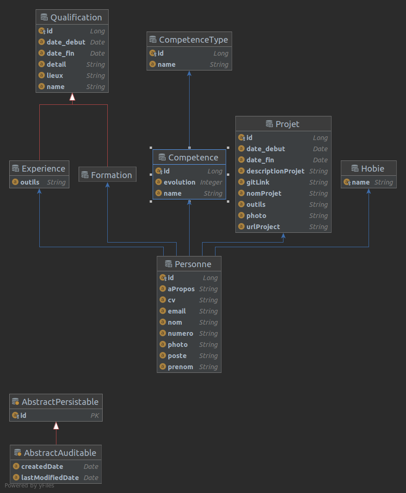
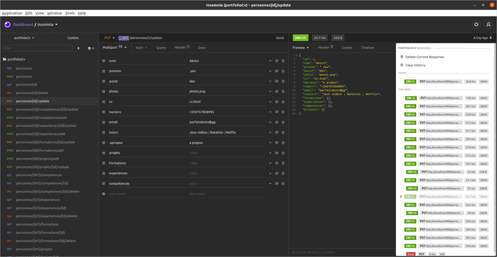

# PortfolioDynamique_Backend_Spring
Prise en main de  Spring Framework. 

### Model pour mon CV 
 

## La forme de notre JSON
```json
[
  {
    "id": 1,
    "nom": "votre Nom",
    "prenom": "votre Prenom",
    "poste": "le poste",
    "photo": "url de laPhoto",
    "cv": "url du cv",
    "numero": "+33076797...",
    "email": "votre@email.com",
    "loisirs": "vos loisirs",
    "formations": [
      {
        "id": 3,
        "date_debut": "2021-05-24",
        "date_fin": "2021-05-24",
        "name": "vos formations",
        "lieux": "lieux de la formation",
        "detail": "description de la formation"
      },
      {
        "id": 4,
        "date_debut": "2021-05-24",
        "date_fin": "2021-05-24",
        "name": "M2 INFO",
        "lieux": "istic",
        "detail": "Je suis une formation à l'istic en IL ...."
      }
    ],
    "experiences": [
      {
        "id": 2,
        "date_debut": "1996-08-26",
        "date_fin": "2021-05-24",
        "name": "vos expé pro",
        "lieux": "liex de expé",
        "detail": "description expé",
        "outils": "outils utilisés"
      },
      {
        "id": 1,
        "date_debut": "2021-05-24",
        "date_fin": "2021-05-24",
        "name": "Equipier à BK",
        "lieux": "BK St Grerégoire",
        "detail": "bla bla bla bla bla bla",
        "outils": null
      }
    ],
    "competences": [
      {
        "id": 1,
        "name": "Français",
        "evolution": 95,
        "competenceType": {
          "id": 1,
          "name": "Langue"
        }
      },
      {
        "id": 2,
        "name": "Spring",
        "evolution": 50,
        "competenceType": {
          "id": 2,
          "name": "Dev"
        }
      }
    ],
    "projets": [
      {
        "id": 2,
        "nomProjet": "Spring_project",
        "descriptionProjet": "Creation de cette API avec Spring",
        "urlProject": null,
        "gitLink": "https://github.com/Artkoto/PortfolioDynamique_Backend_Spring",
        "outils": "IntelliJ",
        "photo": "https://avatars.githubusercontent.com/u/35773837?v=4",
        "date_debut": null,
        "date_fin": null
      },
      {
        "id": 1,
        "nomProjet": "nom projet",
        "descriptionProjet": "description projet",
        "urlProject": "url du projet",
        "gitLink": "depot git du projet",
        "outils": "outils utilisés pour le projet",
        "photo": "image du projet",
        "date_debut": null,
        "date_fin": null
      }
    ],
    "apropos": "a propos de vous"
  }
]
```

## Teste des requêttes HTTP
